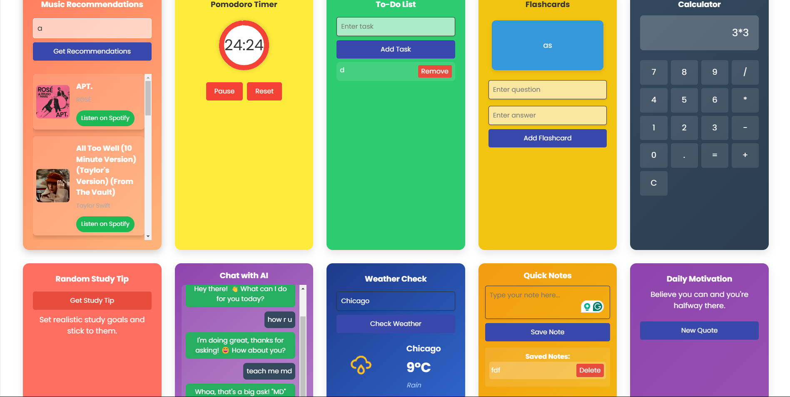
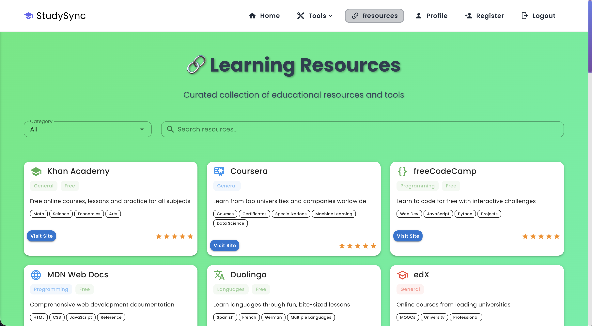
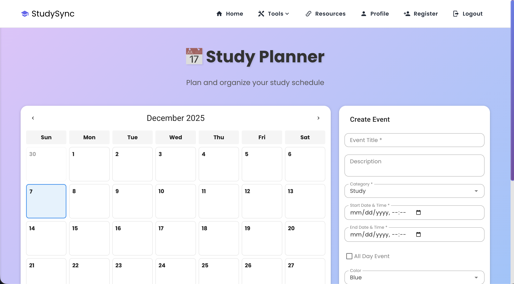
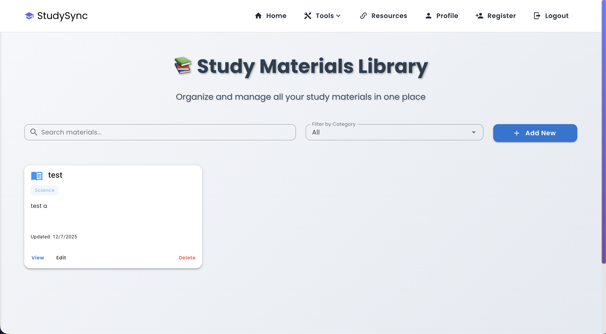
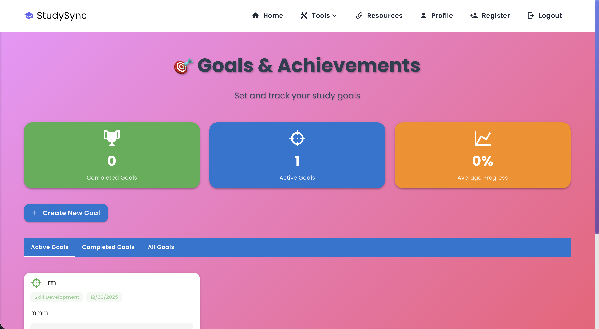
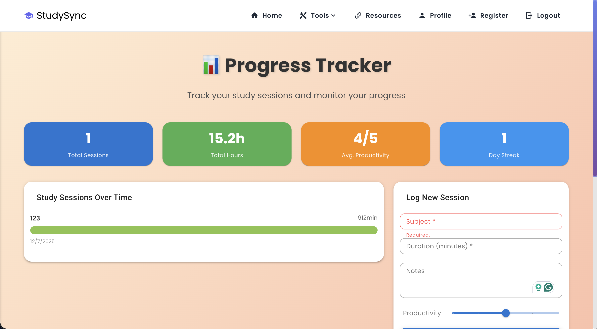
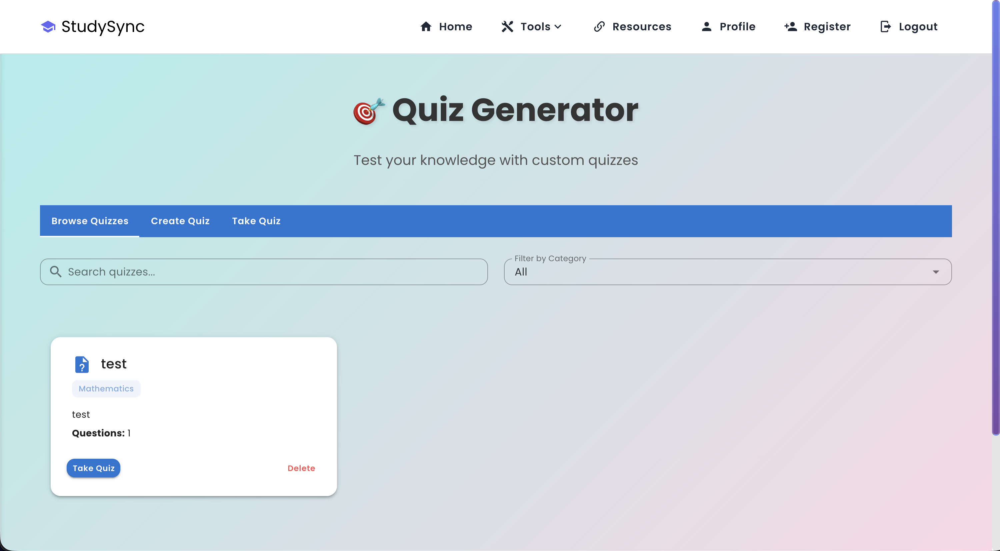
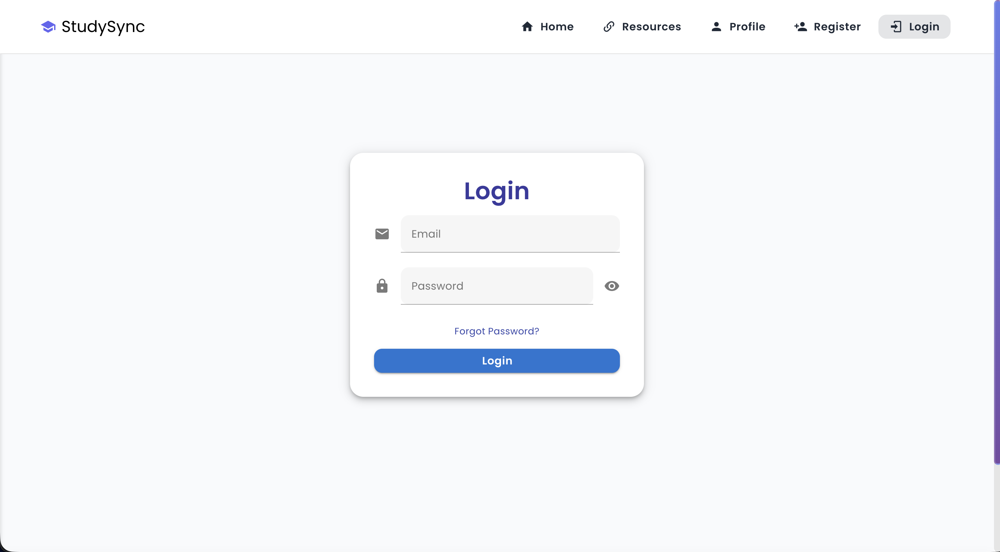
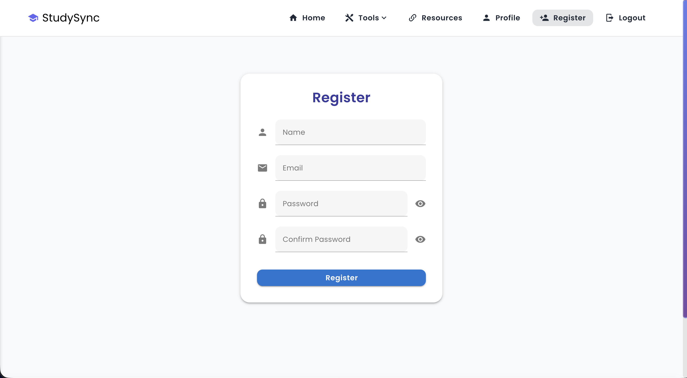

# StudySync - A Productivity and Study Companion App

Welcome to **StudySync**! StudySync is a productivity and study tool designed to help users stay organized and efficient, built with **Vue and Express**. It includes a variety of features such as Pomodoro timers, music recommendations, weather checks, flashcards, to-do lists, and AI chat assistance. It integrates third-party services like Spotify for music and OpenWeather for weather data.

## Features

All the features of the StudySync app include:

- **Pomodoro Timer**: A built-in timer for Pomodoro study sessions.
- **Music Recommendations**: Get music suggestions based on mood using Spotify.
- **Flashcards**: Create, manage, and study flashcards.
- **To-Do List**: Track study tasks and assignments.
- **Calculator**: A scientific calculator for quick calculations.
- **AI Chat**: Chat with an AI assistant for study tips, help, and queries.
- **Study Planner**: Plan and schedule your study sessions.
- **Study Resources**: Access curated study materials and resources.
- **Progress Tracking**: Monitor your study progress and achievements.
- **Learning Goals**: Set and track your learning goals.
- **Quiz Section**: Take quizzes to test your knowledge on various subjects.
- **Weather Check**: Check the weather for any city using OpenWeather.
- **Quick Notes**: Take and store quick notes for your studies.
- **Daily Motivation**: Receive motivational quotes to keep you going.
- **Study Tips**: Get study tips and advice for effective learning.
- **User Authentication**: Register and login to access personalized features.
- **User Profile**: Craft your profile with study interests and goals.
- **Fully Responsive**: Works on all devices and screen sizes.
- **And More!**: Explore the app for additional features and tools.

## Live Deployment

The app is currently live at [https://study-sync-app.vercel.app/](https://study-sync-app.vercel.app/). You can explore the various features and functionalities of the app, including the Pomodoro timer, music recommendations, weather checks, and AI chat assistance.

The backend API is hosted on Render at [https://studysync-study-buddy-app.onrender.com](https://studysync-study-buddy-app.onrender.com/). The frontend is hosted on Vercel and communicates with the backend API for data retrieval and storage.

> [!IMPORTANT]
> **Note**: The app may take a while to spin up, which means it may take 2-3 minutes (max) to load the backend logic. This is due to Render's free tier resource limit, where we are only allocated 0.1 CPU and 512MB RAM. Thank you for your understanding!

## UI Screenshots

Here are some UI screenshots for the app:

### Landing Page

<p align="center">
    
</p>

### Tools List

<p align="center">
    
</p>

### Study Resources Page

<p align="center">
    
</p>

### Study Planner Page

<p align="center">
    
</p>

### Study Materials Page

<p align="center">
    
</p>

### Learning Goals Page

<p align="center">
    
</p>

### Progress Tracking Page

<p align="center">
    
</p>

### Quiz Section

<p align="center">
    
</p>

### Login Page

<p align="center">
    
</p>

### Register Page

<p align="center">
    
</p>

## Tech Stack

### Frontend

- **Vue.js** (JavaScript Framework)
- **Vuetify** (Material Design Components)
- **Axios** (HTTP Requests)
- **Vuex** (State Management)
- Markdown Rendering with `marked` (for AI-generated responses)
- **Webpack** (Module Bundler)
- **Babel** (JavaScript Compiler)
- **ESLint** (Code Linter)
- **Prettier** (Code Formatter)
- **Vue Router** (Page Navigation)
- **Vue CLI** (Vue Command Line Interface)

### Backend

- **Node.js with Express.js**
- **MongoDB** (Database)
- **JWT** (Authentication)
- **Spotify API** (for music recommendations)
- **OpenWeather API** (for weather data)
- **Gemini API** (for AI chat functionality)
- **Swagger** (API Documentation)
- **OpenAPI** (API Specification)
- **Nginx** (Reverse Proxy & Load Balancer)

### DevOps & Deployment

- **Git and GitHub** for version control
- **Google Gemini** (for AI chat functionality)
- **OpenWeather API** (for weather data)
- **Docker** (for containerization)
- **Jenkins** (for CI/CD)
- **Vercel and Render** for deployment

## File Structure

```plaintext
StudySync-Study-Buddy-App/
│
├── backend/                            # Backend (Node.js + Express)
│   ├── config/                         # Database and configuration files
│   │   └── db.js                       # Database connection
│   ├── swagger/                        # Swagger API documentation
│   │   └── swagger.js                  # Swagger setup
│   ├── controllers/                    # Controllers handling requests
│   │   └── controllers.js              # Main controller file
│   ├── middleware/                     # Middleware for authentication
│   │   └── middleware.js               # Auth middleware to protect routes
│   ├── models/                         # Mongoose models (User, Group)
│   │   └── models.js                   # Mongoose models
│   ├── routes/                         # API Routes for endpoints
│   │   └── routes.js                   # Route definitions
│   ├── services/                       # External services (AI, Weather, Spotify)
│   │   └── services.js                 # Helper functions for services
│   ├── views/                          # Views (if using any templating engines)
│   ├── .env                            # Environment variables for sensitive data
│   ├── app.js                          # Main backend application file
│   ├── package.json                    # Backend dependencies
│   └── package-lock.json               # Lock file for backend dependencies
│
├── frontend/                           # Frontend (Vue.js + Vuetify)
│   ├── public/                         # Static files (favicon, index.html)
│   │   ├── favicon.ico                 # App favicon
│   │   ├── index.html                  # HTML template
│   ├── src/                            # Source code for frontend
│   │   ├── assets/                     # Static assets (images, logos, etc.)
│   │   │   ├── logo.png                # App logo
│   │   │   └── logo.svg                # SVG logo
│   │   ├── components/                 # Reusable Vue components
│   │   │   ├── ChatAI.vue              # AI Chat component
│   │   │   ├── FooterComponent.vue     # Footer component
│   │   │   ├── MusicRecommendation.vue # Music recommendation component
│   │   │   ├── NavbarComponent.vue     # Navbar component
│   │   │   ├── SearchProfiles.vue      # Search profiles component
│   │   │   ├── UserLogin.vue           # User login component
│   │   │   ├── UserRegister.vue        # User registration component
│   │   │   ├── UserProfile.vue         # User profiles component
│   │   │   └── StudyGroup.vue          # Study group component
│   │   ├── plugins/                    # Vue plugins (Vuetify, Axios)
│   │   │   ├── webfonloader.js         # Webfont loader
│   │   │   ├── axios.js                # Axios setup
│   │   │   └── vuetify.js              # Vuetify setup
│   │   ├── store/                      # Vuex store for global state management
│   │   │   └── index.js                # Vuex store setup
│   │   ├── router/                     # Vue Router for page navigation
│   │   │   └── index.js                # Router setup
│   │   ├── views/                      # Vue views for different pages
│   │   │   ├── HomePage.vue            # Home page view
│   │   │   └── DashboardPage.vue       # Dashboard view
│   │   ├── api.js                      # API service for making HTTP requests
│   │   ├── main.js                     # Main Vue application file
│   │   └── App.vue                     # Main Vue component
│   ├── .env                            # Environment variables for API URL
│   ├── babel.config.js                 # Babel configuration
│   ├── jsconfig.json                   # JavaScript configuration
│   ├── vue.config.js                   # Vue configuration
│   ├── package.json                    # Frontend dependencies
│   └── package-lock.json               # Lock file for frontend dependencies
│
├── .env                                # Environment variables for API keys and secrets
├── README.md                           # This README file
└── package.json                        # Root package.json file for the entire project
```
## API Documentation

### Table of API Endpoints

| **API Endpoint**            | **Method** | **Description**                                            |
| --------------------------- | ---------- | ---------------------------------------------------------- |
| `/auth/register`            | POST       | Registers a new user with name, email, and password.       |
| `/auth/login`               | POST       | Authenticates the user and returns a JWT token.            |
| `/profile/:userId?`         | GET        | Retrieves the profile data of the authenticated user.      |
| `/profile`                  | PUT        | Updates the profile information of the authenticated user. |
| `/search`                   | GET        | Searches for user profiles based on the query.             |
| `/weather`                  | GET        | Fetches weather data for a given city.                     |
| `/groups`                   | POST       | Creates a new study group.                                 |
| `/groups/:groupId/sessions` | POST       | Creates a new study session for the group.                 |
| `/cities`                   | GET        | Provides city suggestions based on a query.                |
| `/music`                    | GET        | Fetches music recommendations based on a mood.             |
| `/ai-chat`                  | POST       | Allows users to chat with the AI for study assistance.     |

Happy studying! 
